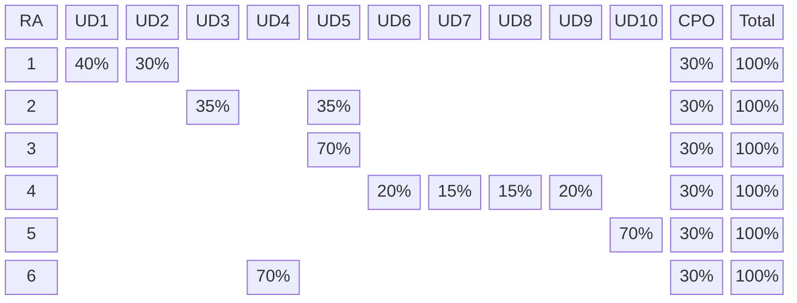

# 0225 Xarxes Locals

Repositori del mòdul 0225 Xarxes Locals del cicle formatiu de grau mitjà Sistemes Microinformàtics i Xarxes a Escola Pia de Mataró.

## Descripció del mòdul

- Nom: Xarxes Locals
- Codi: 0225
- Curs: 1r curs del cicle formatiu de grau mitjà Sistemes Microinformàtics i Xarxes
- Durada: 132 hores (4 hores/setmana) + 66 hores estada empresa (10% de la nota final del mòdul)

Professors:

- Carlos Alonso Martínez `carlos.martinez@mataro.epiaedu.cat`
- Cristina Reina León `cristina.reina@mataro.epiaedu.cat`
- Blai Redondo Del Viejo `blai.redondo@mataro.epiadu.cat`

A la programació del mòdul teniu detallada tota la informació sobre el contingut, objectius, competències i criteris d’avaluació del mòdul, a continuació exposem la informació més rellevant.

## Competència general del mòdul

Instal·lar, configurar i mantenir sistemes microinformàtics, aïllats o en xarxa, així com xarxes locals en  petits entorns, assegurant la seva  funcionalitat i aplicant els protocols de qualitat, seguretat i respecte al medi ambient establerts.

## Competències professionals, personals i socials associades al mòdul

- c) Instal·lar i configurar programari bàsic i d’aplicació, assegurant-ne el funcionament en condicions de  qualitat i seguretat.
- e) Instal·lar i configurar xarxes locals cablejades, sense fil o mixtes, i la seva connexió a xarxes  públiques, assegurant-ne el funcionament en condicions de qualitat i seguretat
- f) Instal·lar, configurar i mantenir serveis multiusuari, aplicacions i dispositius compartits en un entorn de xarxa local, atenent les necessitats i requeriments especificats.
- g) Realitzar les proves funcionals en sistemes microinformàtics i xarxes locals, localitzant i diagnosticant disfuncions per comprovar i ajustar el funcionament.
- h) Mantenir sistemes microinformàtics i xarxes locals, substituint-ne, actualitzant-ne i ajustant-ne els components per assegurar el rendiment del sistema en condicions de qualitat i seguretat.
- j) Elaborar documentació tècnica i administrativa del sistema, complint les normes i reglamentació del  sector per al seu manteniment i l’assistència al client
- l) Assessorar i assistir el client, canalitzant a un nivell superior els supòsits que ho requereixin per trobar solucions adequades a les necessitats d’aquest.

## Resultats d’aprenentatge del mòdul

- RA1. Reconeix l'estructura de xarxes locals cablejades analitzant-ne les característiques d'entorns d'aplicació i descrivint-ne la funcionalitat dels seus components.
- RA2.  Desplega el cablejat d'una xarxa local interpretant-ne especificacions i aplicant-hi tècniques de muntatge.
- RA3. Interconnecta equips en xarxes locals cablejades descrivint estàndards de cablejat i aplicant tècniques de muntatge de connectors.
- RA4. Instal·la equips en xarxa, descrivint les seves prestacions i aplicant tècniques de muntatge.
- RA5. Manté una xarxa local interpretant recomanacions dels fabricants de maquinari o programari i establint la relació entre disfuncions i les seves causes.
- RA6. Compleix les normes de prevenció de riscos laborals i de protecció ambiental, identificant els riscos associats, les mesures i equips per a prevenir-los.

## Organització del mòdul

El mòdul s'organitza en 8 unitats que corresponen a les activitats d'ensenyament-aprenentatge definides a la programació del mòdul, i que es corresponen amb els resultats d'aprenentatge (RA) establerts al currículum oficial:

1. UD1: Introducció a les xarxes locals (RA1)
2. UD2: Arquitectura de xarxes (RA1)
3. UD3: Elements de la xarxa local (RA2)
4. UD4: Riscos laborals i protecció ambiental (RA6)
5. UD5: Cablejat de xarxes locals (RA2 i RA3)
6. UD6: Protocols TCP/IP (RA4)
7. UD7: Capa Internet i adreçament IP (RA4)
8. UD8: Commutadors de xarxa local (RA4)
9. UD9: Encaminadors de xarxa (RA4)
10. UD10: Xarxes sense fil (RA4)
11. UD11: Resolució d'incidències i monitorització (RA5)

## Avaluació del mòdul

La nota del mòdul es calcularà a partir de les qualificacions dels diferents resultats d’aprenentatge (RA) i de l’estada a l’empresa (EEM), segons la fórmula següent:

$$
QMP = 0,15 \cdot QRA_1 + 0,15 \cdot QRA_2 + 0,15 \cdot QRA_3 + 0,30 \cdot QRA_4 + 0,10 \cdot QRA_5 + 0,05 \cdot QRA_6 + 0,10 \cdot QEM
$$

Per aprovar el mòdul professional:

- La nota del mòdul ha de ser superior o igual a 5.
- La nota de cadascun dels RA (resultats d’aprenentatge) ha de ser igual o superior a 5.

Si se supera el mòdul i encara no s'ha finalitzat l'estada a l'empresa, el mòdul restarà pendent de qualificar (PQ) fins que es completi l'estada a l'empresa i es pugui assignar la nota corresponent.

### Avaluació dels resultats d’aprenentatge (RA)

La nota de cada es RA es calcula a partir de la nota ponderada de les diferents unitats o actictats d'ensenyament-aprenentatge sempre i quan la nota de cada unitat sigui igual o superior a 5. Aquesta qualificació conjunta suposa un 70% de la nota. Un 30% de la nota correspon a les competències personals i socials.

A la següent taula es mostra la correspondència entre els RA i les activitats d'ensenyament-aprenentatge (unitats):

<!-- Aquí cal posar la taula de correspondència -->

### Avaluació de les activitats d'ensenyament-aprenentatge (unitats)

Cada unitat didàctica s'avaluarà mitjançant una combinació de proves teòriques i pràctiques, així com la realització de projectes i activitats avaluables.

Per considerar superada la unitat cal que la **nota de les proves o exàmens** (teòrics o pràctics) sigui com a mínim un 4, sempre i quan la mitjana ponderada de la unitat sigui igual o superior a 5.

### Segona convocatòria

Cas que no se superi algun RA a la primera convocatòria (avaluació contínua), a segona convocatòria caldrà avaluar només les unitats que es van suspendre, **substiuint-se la nota obtinguda d'aquella unitat en primera convocatòria**.

## Ús de la IA

La utilització d'eines d'intel·ligència artificial (IA) per la realització de treballs està regulat per la normativa de l'escola i del mòdul.  Les normes d'ús de la IA les pots consultar a la documentació del cicle.

## Altres informacions

Al Moodle hi trobareu l'accés als materials del mòdul, així com les activitats d'avaluació i les tasqueS per lliurar-les.

El material necessari per les pràctiques al taller: eines, cablejat, etc. estarà disponible al taller.

📵 Ni a l'aula ni al taller es permetrà l'ús de telèfons mòbils, tauletes o altres dispositius electrònics que no estiguin relacionats amb les activitats d'ensenyament-aprenentatge.
